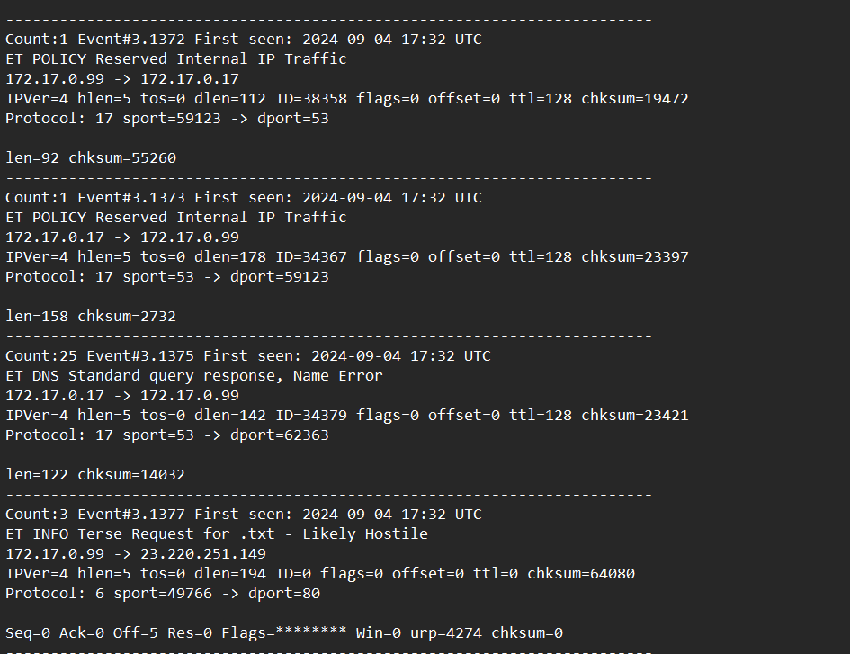
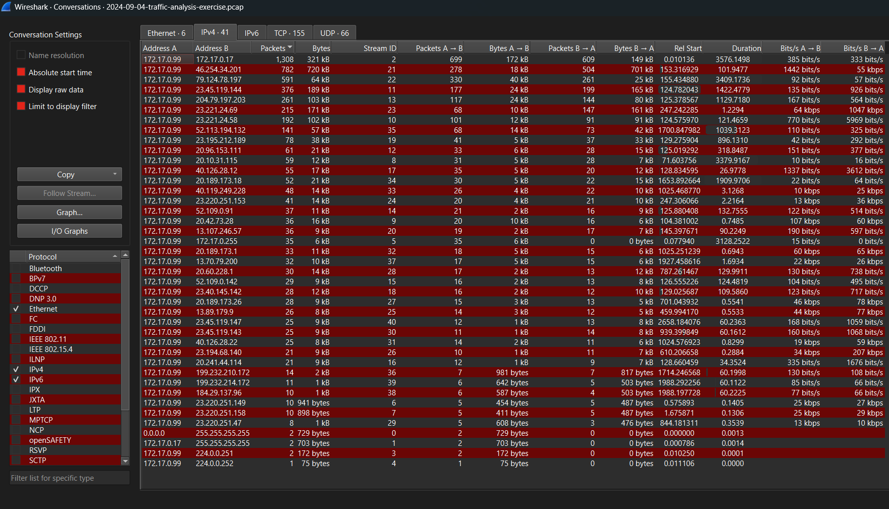
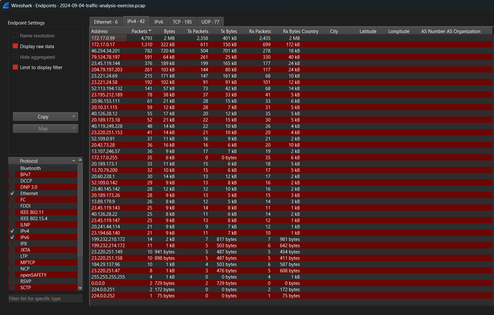
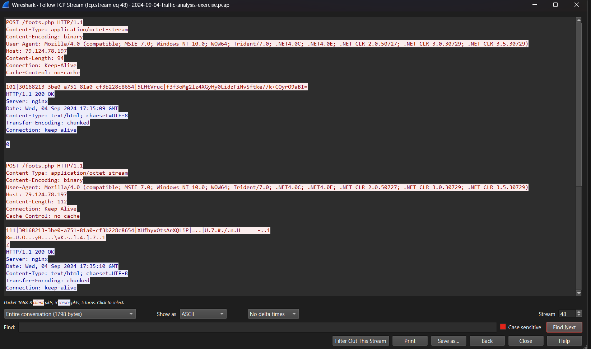

# Case: Big Fish In a Little Pond 

This lab exercise demonstrates the capture and analysis of network traffic using Wireshark, with a focus on identifying suspicious activity and understanding packet communication.

# 1. Investigation Context 
This section describes the provided environment and network baseline used during the investigation.

## Background

Reviewing the alerts in the network environment, indicators suggest that a host within the internal network has been infected with malware.

##  Scenario

LAN segment details:

- LAN segment range:  172.17.0[.]0/24 (172.17.0[.]0 through 172.17.0[.]255)
- Domain: bepositive.com
- Domain Controller: 172.17.0.17 (WIN-CTL9XBQ9Y19)
- AD Environment Name: BEPOSITIVE
- Gateway: 172.17.0.1
- Broadcast Address: 172.17.0.255

##  Task

* Write an incident Report based on malicious network activity from the pcap and from the alerts. 

- The incident report should contains 3 sections:
	- **Executive Summary**: State in simple, direct terms what happened (when, who, what).
	- **Victim Details**: Details of the victim (hostname, IP address, MAC address, Windows user account name).
	- **Indicators of Compromise (IOCs)**: IP addresses, domains and URLs associated with the activity.  SHA256 hashes if any malware binaries can be extracted from the pcap.

# 2. Executive Summary

At 2024-09-04, Andrew Fletcher visits a website bellantonicioccolato[.]it (46[.]254.34.201), a domain containing KoiLoader. His desktop gets infected and soon after makes GET request to 79[.]124.78.197/index.php and starts extraction of data via POST /foots.php

# 3. Victim Details

| Field       | Value             |
| ----------- | ----------------- |
| Hostname    | DESKTOP-RNVO9AT   |
| IP Address  | 172.17.0.99       |
| MAC Address | 18:3d:a2:b6:8d:c4 |
| User        | Andrew Fletcher   |

# 4. Timeline

| Time(UTC)               | Events                                        |
| ----------------------- | --------------------------------------------- |
| 2024-09-04 12:35:04.85  | Andrew visits malicious website               |
| 2024-09-04 12:35:07.21  | HTTP POST /foots.php                          |
| 2024-09-04 12:35:11.31  | HTTP GET /index.php to C2 server              |
| 2024-09-04 12:35:12.54- | Periodic HTTP POST /foots.php |

# 5. Methodology

Investigation conducted using Wireshark 4.6.4 and Virustotal on KaliVM. Following techniques were applied:
* Utilizing alerts to construct protocols and timelines.
 
* Conversation analysis.
  
* Endpoint analysis.
  
* Protocol filtering (DNS -> SMB -> KERBEROS -> HTTP).
* TCP and HTTP stream inspection.
  

# 6. Findings

### 6.1 Initial Access

The host accessed:
- www[.]bellantonicioccolato[.]it 
- Associated IP: 46[.]254.34.201

### 6.2 Command and Control

Shortly after infection, the infected desktop begins communication with: 
- Associated IP: 79[.]124.78[.]197

Observed endpoints:
* /index.php (HTTP GET)
* /foots.php (HTTP POST)

Indicating communication between C2.

# 7. Data Exfiltration

HTTP Post requests contained encoded packages:

101|30168213-3be0-a751-81a0-cf3b228c8654|5LHtVruc|f3f3oMg2lz4XGyHy0LidzFiNvSftke//k+COyrO9aBI=

111|30168213-3be0-a751-81a0-cf3b228c8654|XHfhyxOtsArXQLiP|=..|U.7.#./.n.H -..1

....

This suggest likely exfiltration of further staging. 

# 8. IOCs

| Type               | Indicator                 |     |
| ------------------ | ------------------------- | --- |
| IP (infected host) | 172.17.0.99               |     |
| MAC Address        | 18:3d:a2:b6:8d:c4         |     |
| Initial Domain     | bellantonicioccolato[.]it |     |
| C2 Server IP       | 79.124.78.197             |     |
| HTTP URI           | /index.php                |     |
|                    | /foots.php                |     |
|                    |                           |     |

# 9. File Hashes

No malicious files were identified within the packets, no hashes were extracted.  

# 10. Conclusion

The DESKTOP-RNVO9AT has been infected and traffic strongly suggest there was data exfiltrated to a malicious actor.  Recommended containment and eradication, as well as, reset of all Andrew Fletcher credentials.
